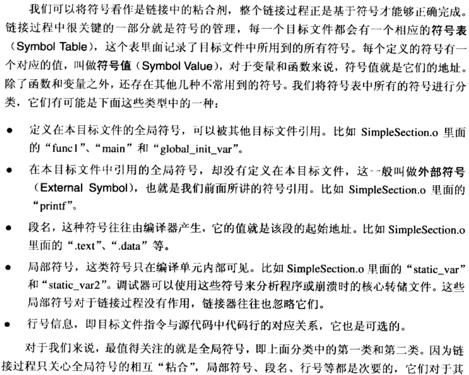

# 3目标文件的格式


<!--more-->
## 目标文件的格式
现在PC平台流行的可执行文件格式主要时Windows下的PE（Portable Executable）和Linux的ELF（Executable Linkable Format），它们都是COFF（Common file format）格式的变种。   
目标文件就是源文件编译后但未进行链接的那些中间文件（Windows的.obj和Linux的.o），它跟可执行文件的内容与结构很相似，所以一般跟可执行文件格式一起采用同一种格式存储。   
从广义上看，目标文件与可执行文件的格式其实几乎是一样的，所以我们可以广义地将目标文件与可执行文件看成事一种类型的文件，在Windows下，我们可以统称他们为PE-COFF文件格式。在Linux下，我们可以将他们统称为ELF文件。   
静态链接库稍有不同，它是很多目标文件捆绑在一起形成一个文件，再加上一些索引，可以简单的把它理解为一个包含有很多目标文件的文件包。   
- 可重定位文件（Relocatable File）：这类文件包含了代码和数据，可以被用来链接成可执行文件或共享目标文件，静态链接库也可以归为这一类。例，Linux的.o和Windows的.obj
- 可执行文件（Executable File）：这类文件包含了可以直接执行的程序，它的代表就是ELF可执行文件。
- 共享目标文件（shared Object File）：Linux的so和Windows的DLL
- 核心转储文件（Core Dump File）：Linux下的core dump
  
### 目标文件是什么样的
目标文件中的内容有编译后的机器指令代码，还包括了链接时所需要的一些信息，比如符号表、调试信息、字符串等。一般目标文件将这些信息按不同的属性，以节Section的形式存储，有时候也叫段Segment。
- .text: 保存编译后的机器码
- .data: 保存已初始化的全局变量和局部静态变量
- .bss: (Block Started by Symbol)bss段只是为未初始化的全局变量和局部静态变量预留位置，它并没有内容（默认值都是0）。
- .rodata段: 用于存放只读数据，一般数程序里面的只读变量，如const修饰的变量和常量字符串

```c
static int x1 = 0; // 在.bss段
static int x2 = 1; // 在.data段
// 初始化为0可以认为是未初始化,所以被优化掉了可以放在bss段
```
 
总体来说，程序源代码被编译后主要分为两种段，程序指令和程序数据。代码段属于程序指令，而数据段和.bss属于程序数据。
### 为什么把程序指令和数据分开放？优点是什么？
1. 一方面是当程序被装载后，数据和指令分别被映射到两个虚拟区域，由于数据区域读进程来说是可读写的，而指令区域对进程来说是只读的，所以这两个虚存区域的权限可以分别被设置成可读写和只读。这样可以方式程序的指令被有意或无意的改写。
2. 另一方面是对于现代的CPU来说，它们有着极为强大的缓存（Cache）体系。由于缓存在现代的计算机中地位非常重要，所以程序必须尽量提高缓存命中率，指令区和数据区的分离有利于提高程序的局部性。现代CPU的缓存一般都被设计成数据缓存和指令缓存分离，所以程序的指令和数据被分开存放对CPU的缓存命中率提高有好处。
3. 第三个原因是共享指令。当系统中运行着多个该程序的副本时，它们的指令都是一样的，所以内存中只需要保存一份该程序的指令部分。对于指令这种只读的区域来说是这样，对于其他的只读数据也一样，比如很多程序里面带有的图标，图文，文本等资源也是数据可以共享的。当然每个副本进程的数据区域是不一样的，它们是进程私有的。

> **对于全局变量来说，如果初始化了不为0的值，那么该全局变量则被保存在data段，如果初始化的值为0，那么将其保存在bss段，如果没有初始化，则将其保存在common段，等到链接时再将其放入到BSS段。关于第三点不同编译器行为会不同，有的编译器会把没有初始化的全局变量直接放到BSS段。**  [原文链接](https://blog.csdn.net/Arlingtonroad/article/details/107516680)  
> [**COMMON块详解**](https://www.cnblogs.com/fr-ruiyang/p/10483397.html)      

### 自定义段
GCC提供了一个扩展机制，可以指定变量所处的段：
```c
__attribute__((section("FOO"))) int global = 42;
__attribute__((section("BAR"))) void foo() {}
```

### binutils(readelf, objdump, nm)常用工具及用法
``` bash
# -s 显示所有请求section的内容
# -d 反汇编
objdump -s -d SimpleSection.o

# 读取ELF头信息
readelf -h SimpleSection.o

# 读取段表头信息 section header
readelf -SW SimpleSection.o
objdump -h SimpleSection.o 
```

### ELF文件结构描述
ELF目标文件格式的最前部是ELF文件头，它包含了描述整个文件的基本属性，比如ELF文件版本，目标机器型号，程序入口地址等。
详见章节3.4节


## 链接的接口：符号
在链接中，目标文件之间的相互拼合实际上是目标文件之间对地址的应用，即对函数和变量的地址的引用。我们将函数和变量统称为**符号**，函数名和变量名统称为**符号名**。几种不常用到的符号：    
  
nm查看符号表：`nm SimpleSection.o`   

## extern "C"
extern语法规则
``` cpp
// 写法一
extern "C" {
int func();
int var;
}

// 写法二
extern "C" int func();
extern "C" int var;

// 导出CPP中的符号
extern "C" double _ZN6myname3varE;
```

导出cpp命名空间中的变量
``` cpp 
#include <stdio.h>

namespace myname
{
int var = 42;
}

extern "C" double _ZN6myname3varE;  // 定义不会报错, 使用时会有问题
// extern "C" int _ZN6myname3varE;     // 正确定义

int main(int argc, char* argv[])
{
    printf("%d\n", myname::var);              // 42
    printf("%d\n", *(int*)&_ZN6myname3varE);  // 42
    printf("%d\n", int(_ZN6myname3varE));     // 0
    return 0;
}
```

## 强符号和弱符号
强符号：编译器默认函数和初始化的全局变量为强符号
弱符号：未初始化的全局变量为弱符号。也可以通过`__attibute__((weak))`来指定。   
注意，强符号和弱符号都是针对定义来说的，不是针对符号引用。
编译器关于强弱符号的规则有：
1. 强符号不允许多次定义，但强弱可以共存；
2. 强弱共存时，强覆盖弱；
3. 都是弱符号时，选择占用空间最大的，如选择double类型的而不选择int类型的。  
| 变量名称     | 初始化 | 未初始化 |
| ------------ | ------ | -------- |
| 全局变量     | .data  | .common  |
| 静态全局变量 | .data  | .bss     |
| 静态局部变量 | .data  | .bss     |
``` cpp
int g_init_var = 10;          // .data
static int sg_init_var = 20;  // .data

int g_uninit_var;          // .common
static int sg_uninit_var;  // .bss

int main(int argc, char* argv[])
{
    static int sl_init_var = 30;  // .data
    static int sl_uninit_var;
    return 0;
}
```   
**强引用和弱引用详见3.5.5**

---

> 作者: Yu  
> URL: https://blog.zy9826.site/notebook/16b9b184070f/  

