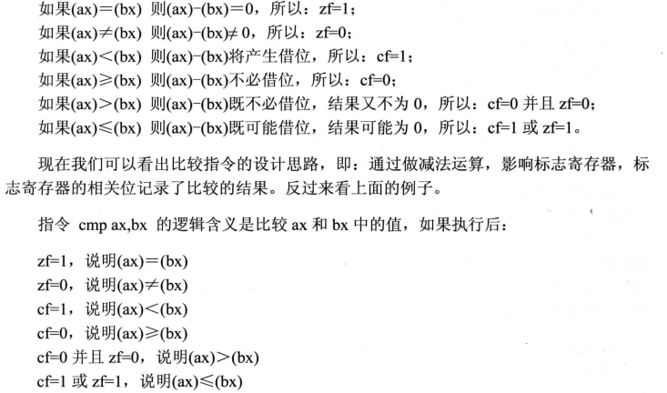
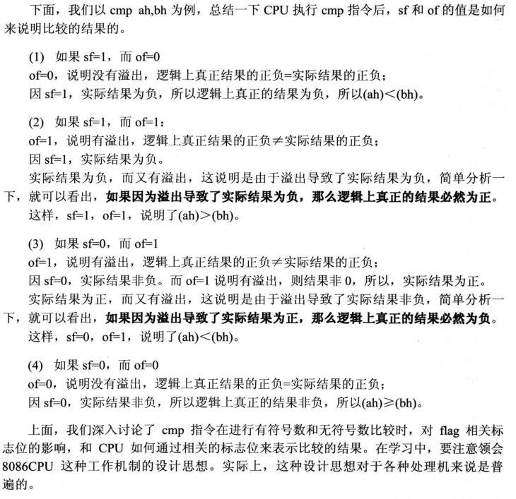
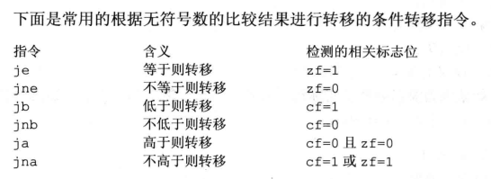

# 汇编指令


<!--more-->

## adc 带进位加法指令
adc是带进位加法指令, 它利用了CF位上记录的进位值.  
指令格式: adc obj1, obj2  
功能: obj1 = obj1 + obj2 + CF  
比如`adc ax,bx`实现的功能是(ax)=(ax)+(bx)+CF  
``` asm
mov ax,2
mov bx,1
sub bx,ax ; CF=1
adc ax,1 ; (ax)+1+CF=2+1+1=4
```
### adc指令的作用
用来进行加法的第二步运算, adc指令和add指令配合就可以对更大的数据进行加法运算.   

## sbb 带借位减法指令
sbb是带借位减法指令, 它利用了CF位上记录的借位值.  
指令格式: sbb obj1, obj2  
功能: obj1 = obj1 - obj2 - CF  
比如`sbb ax,bx`实现的功能是(ax)=(ax)-(bx)-CF. 作用和adc类似  


## cmp 比较指令
cmp比较指令, cmp的功能相当于减法指令, 只是不保存结果. cmp指令执行后将对标志寄存器产生影响. 其他相关指令通过识别这些被影响的标志寄存器来得知比较结果.  
指令格式: cmp obj1, obj2
功能: 计算obj1-obj2但不保存结果, 仅根据计算结果对标志寄存器进行设置  


### 无符号数的比较
无符号数比较检测zf, cf  


### 有符号数的比较
有符号数比较检测sf, of, zf  



## 条件转移指令
jcxz, 是一个条件转移指令, 它可以检测cx中的数值, 如果(cx)=0就修改IP  
**所有条件转移指令的转移位移都是[-128,127]  
  
b: below  
a: above  

---

> 作者: Yu  
> URL: https://blog.zy9826.site/notebook/5f970c78790f/  

