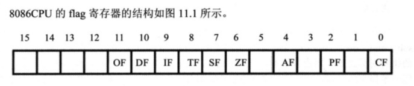
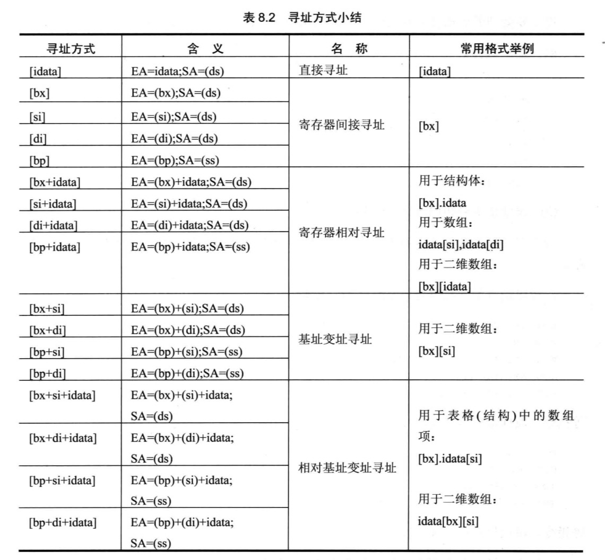

# DosBox安装和汇编基础


<!--more-->

## 环境安装和调试指令
1. DosBox直接安装, MASM文件夹（包含调试工具）拷贝到D盘
2. 设置DosBox窗口大小
   - 到安装路径运行`DOSBox 0.74 Options.bat`, 修改以下两行
       ```
         windowresolution=1000x1300
         output=ddraw
       ```
3. 运行DosBox
   - 输入以下命令挂载工具目录到C: `mount c d:masm`
   - 进入到C: `c:`; 运行debug模式 `debug`
4. debug模式的常用命令
   - r: register, 查看或改变CPU寄存器的内容
   - d: dump, 查看内存中的内容
   - e: enter, 改写内存中的内容
   - u: unassemble, 将内存中的机器指令翻译成汇编指令
   - t: trace, 执行一条机器指令
   - a: assemble, 以汇编指令的格式在内存中写入一条机器指令


## 寄存器表
- AH&AL = AX(accumulator)：累加寄存器
- BH&BL = BX(base)：基址寄存器
- CH&CL = CX(count)：计数寄存器
- DH&DL = DX(data)：数据寄存器
- SP (Stack Pointer)：堆栈指针寄存器
- BP (Base Pointer)：基址指针寄存器
- SI (Source Index)：源变址寄存器
- DI (Destination Index)：目的变址寄存器
- IP (Instruction Pointer)：指令指针寄存器
- CS (Code Segment)：代码段寄存器
- DS (Data Segment)：数据段寄存器
- SS (Stack Segment)：堆栈段寄存器
- ES (Extra Segment)：附加段寄存器

### 标志寄存器

- OF overflow flag 溢出标志: 操作数超出机器能表示的范围表示溢出，溢出时为1.
- DF（方向标志）：用于串处理。DF=1时，每次操作后使SI/DI减小；DF=0时则增大。
- IF（中断标志）：IF=1时，允许CPU响应可屏蔽中断，否则关闭中断。
- TF（陷阱标志）：用于调试单步操作。
- SF sign flag 符号标志: 记录运算结果的符号，结果为负时SF=1，否则SF=0。
- ZF zero flag 零标志: 运算结果等于0时ZF=1，否则ZF=0。
- AF（辅助进位标志）：运算时，第3位向第4位产生进位时为1，否则为0。
- PF parity flag 奇偶标志: 运算结果操作数位为1的个数为偶数个时PF=1，否则PF=0。
- CF carry flag 进位标志：最高有效位产生进位时CF=1，否则CF=0。  
  
|0/1|OF |DF |SF |ZF |AF |PF |CF |  
|---|---|---|---|---|---|---|---|  
|1  |OV |DN |NG |ZR |   |PE |CY |  
|0  |NV |UP |PL |NZ |   |PO |NC |  

### 溢出标志具体检测方法
CPU 在执行加法指令后，会检查两个操作数的最高位（符号位）和结果的最高位。如果两个操作数的符号位相同，而结果的符号位与操作数的符号位不同，就设置溢出标志。   
例如，对于两个 8 位有符号数 A 和 B，其符号位分别为 A7 和 B7，结果的符号位为 S7。如果 A7 = B7 且 A7 ≠ S7，就设置溢出标志。   
OF=0, CF=1 : D0h+E0h  
OF=1, CF=0 : 7Fh+01h=80(-128)  
OF=1, CF=1 : 90h+90h  
  
## 常用指令
- mov, 赋值指令; `mov ax,100`
- add, 加法指令, add指令溢出后高位舍弃; `add ax,100`
- sub, 减法指令, sub指令溢出后高位舍弃; `sub ax,100`
- and, 按位与指令; `and ax,3333h`
- or, 按位或指令; `or ax,3333h`
- shl/shr, 逻辑左移/右移指令, 功能如下:
  - 将一个寄存器或内存单元中的数据向左移位
  - 将最后移出的一位写入CF中, 
  - 最低位用0填充
  - 例: `shl ax,1`; 使用立即数时只能移动一位
  - 移动多位需要使用寄存器, 例:
  ```
  mov cl, 3
  shl ax, cl
  ```
- inc: 自增1 `inc ax`
- dec: 自减1 `dec ax`
- nop: 空指令
- xchg: 交换指令 `xchg ax,bx`
- neg: 算术取反 `neg ax`
- int: 中断 `int 21h` 退出程序

- ds寄存器不能赋值立即数
``` asm
mov ax,21F0h
mov ds,ax
mov [0],ax
```

- jmp: 跳转指令, 修改CS:IP
```
jmp ax
jmp 1000:3
```

### mul指令
- mul是乘法指令, 需要注意的是: 两个相乘的数要么都是8位,要么都是16位. 如果是8位一个默认放在AL中, 另一个放在8位reg或内存单元中; 如何是16位, 一个默认在AX中, 另一个放在16位reg或内存单元中.
- 结果: 如果是8位乘法, 结果默认放在AX中; 如果是16位乘法, 结果高位默认存放在DX中, 低位存放在AX中

### div指令
div是除法指令, 使用此指令是应注意以下问题:
1. 除数, 有8位和16位两种, 在一个reg或内存单元中
2. 被除数, 默认放在 AX 或 DX和AX 中, 如果除数位8位, 被除数则为16位, 默认放在AX中存放; 如果除数为16为, 被除数则为32位, 在DX和AX中存放, DX放高16位, AX放低16位. 
举例:
``` asm
div byte ptr ds:[0]
```
(al)=(ax)/(ds*10h+0) ;商   
(ah)=(ax)/(ds*10h+0) ;余数


## 栈
- push ax的执行有以下两步完成:
1. SP=SP-2, SS:SP指针移动
2. 将ax中的内容送入SS:SP指向的内存单元处, SS:SP不变
   
- pop ax的执行有以下两步完成:
1. 将SS:SP指向的内存单元处的数据送入ax中
2. SP=SP+2, SS:SP指针移动
  
## 寻址方式
### bx和bp寄存器
bx: 基址寄存器, 默认以ds为段地址   
bp: 基址指针寄存器, 如果不显示指定段地址, 则默认以ss为段地址   
[bx+idata] : `mov ax,[bx+1]`  
[bx]可以指向一个内存单元, +1是偏移地址: 
### si和di寄存器
si,di寄存器是和bx功能相似的寄存器, si和di不能分成两个8位寄存器来使用  
[bx+si] : `mov ax,[bx+si]`  
[bx+di] : `mov ax,[bx+di]`  
[bx+si/di+idata] : `mov ax,[bx+si+16]`  
  


---

> 作者: Yu  
> URL: https://blog.zy9826.site/notebook/7c53d0359678/  

